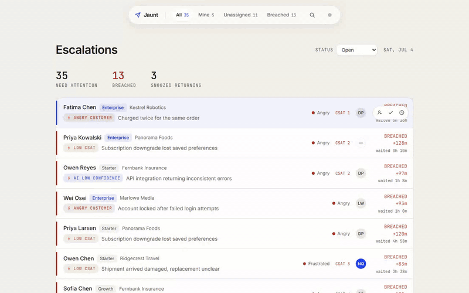

# Conversation Inbox

A triage inbox for a CX agent: open a full queue and know, within seconds, what to act
on first. Conversations are ranked by a priority score (SLA urgency, sentiment, CSAT
risk, tier, wait time), every triage action is optimistic and reversible, and the whole
flow is keyboard-driven. It's a triage tool, not a chat client — agents reply in their
existing tool. Cuts: reply composer, bulk actions, mobile, virtualized lists — reasoning
in [DECISIONS](docs/DECISIONS.md).

**Live demo: [jaunt-anish.vercel.app](https://jaunt-anish.vercel.app)**



## Run it

```bash
npm install     # install deps
npm run dev     # http://localhost:5173  (mock API runs in-browser via MSW)
npm test        # priority + optimistic-mutation tests
```

Desktop-only (≥ 768px). All data is a mock (MSW) — no backend, no env vars.

## Keyboard

| Key | Action | Key | Action |
| --- | --- | --- | --- |
| `j` `k` `↑` `↓` | Move selection | `s` | Snooze menu |
| `Enter` | Open conversation | `u` | Undo last action |
| `Esc` | Back / clear / close | `/` | Focus search |
| `a` | Assign to me | `1`–`4` | Switch tab |
| `r` | Resolve | `?` | Shortcuts overlay |

Flip the failure simulator (the dot in the nav) to watch a write roll back cleanly.

## Architecture

Vite + React 18 + TS (strict) · Tailwind v4 · TanStack Query (server state) · React
Router · MSW v2 (200–500ms latency, one failable write path). Filters live in the URL,
priority is derived per render (never stored), mutations are optimistic with rollback.
Full map → [ARCHITECTURE](docs/ARCHITECTURE.md).

## Limitations

Mock-only (writes reset on reload), no real-time (30s re-rank + 1s SLA clock), single
hard-coded agent, no list virtualization. Details → [LIMITATIONS](docs/LIMITATIONS.md).

Approx time spent: ~8 hours.
